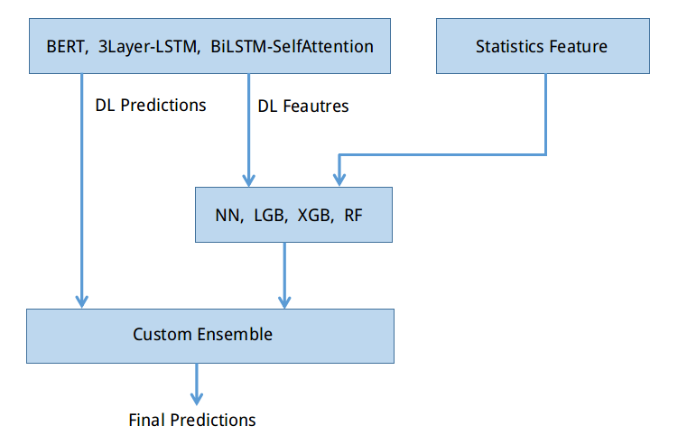

# Kaggle Toxicity Classification

__Competitions:__ [Jigsaw Unintended Bias in Toxicity Classification](https://www.kaggle.com/c/jigsaw-unintended-bias-in-toxicity-classification)  
__Rank:__ 262/3165(top 9%, bronze)   
__Task:__ Text Classification, Predict toxicity text  
__Data:__ trianset:1800k labeled comment text, 'target' is label, many other identity label can be use to help training; testset: 100k comment text  
__Evaluation:__ 4 parts , refer [Competition Evaluation](https://www.kaggle.com/c/jigsaw-unintended-bias-in-toxicity-classification/overview/evaluation)  
__Note:__ This is a code backup, it's not runable due to the difference file path  


## Solution  
1. __文本预处理：__  
	* 预处理的方式要贴近pretrain-embedding的处理方式，不要盲目使用lower, stopword, 词根提取 等等（ refer text_process5.py）  
	* 对不同的embedding使用不同的文本预处理方法，目的还是跟1一样
2. __交叉验证：__  
	* 选择3fold交叉验证，因为bert要跑很久，5fold太久了  
	* 所有步骤，哪怕不同的stage，也要严格遵守同一份cv，避免泄露  
3. __提取DL features：__ 将文本分别喂入不同的模型，得到文本的特征向量
	* BERT由于显卡限制，用的是L-12_H-768_A-12，训练两个epoch（对比top solution仍有很大的可调参空间）  
	* loss计算带权重，根据coutom AUC的评估方式可知，不同的样本对最后评价指标的贡献度是不一样的  
	* 训练集中一些别的标签可以加入预测任务，辅助训练，提升训练效果  
	* 提取DLfeatures的同时可以计算最终test pred，加入最后的ensemble  
4. __提取统计特征：__ 手工特征，(refer utils.py)  
5. __多模型Predict：__ 分别用NN，LGB，XGB，RF做分类预测（这里也用了SVM，但是太慢了，最终放弃）  
6. __模型融合：__ 将三个DL模型+NN，LGB，XGB，RF模型预测结果融合
	* 用的是stacking，所以要拼凑出一份完成的训练集预测  
	* 因为评估标准是custom AUC，做stacking的时候如果选择regression的logistic loss和一般的AUC作为metric，不能很好的指示训练效果，这里自己写了一个随机搜索权重的算法，每次随机选择几个模型增加或减小其权重，直到连续n轮得分不再上涨，（refer ensemble.py）  
	




## File Discribe
```
----- on-line-inference
  |            |
  |            |----- toxicity-final-inference.ipynb: Kaggle kernel final submission file
  |            |
  |             ----- toxicity_final_inference.py: convert .ipynb to .py
  |
   -- off-line-train
               |
               |----- features: use to eatract DL features
               |            |
               |            |----- dl_train_cv.py: train LSTM models
               |            |
               |            |----- dl_inference.py: extact LSTM features & predict
               |            |
               |            |----- dl_bert_train.py: train BERT models
               |            |
               |             ----- dl_bert_inferecne.py: extact BERT features & predict
               | 
               |----- emsemble: 1.train and inference on different model 2.ensemble predictions
               |            | 
               |            |----- nn_train_inference.py: NN train & predict
               |            | 
               |            |----- lgb_train_inference.py: LGB train & predict
               |            | 
               |            |----- random_forest_train_inference.py: RF train & predict
               |            | 
               |            |----- xgb_train_inference.py: XGB train & predict
               |            | 
               |             ----- ensemble.py: custom ensemble predictions 
               |
               |----- text_process5.py: text preprocess
               |
               |----- models.py: Pytorch DL models 
               |
               |----- dataset_helper.py: custom DataLoader
               |
               |----- global_variable.py: global_variable
               |
                ----- utils.py
```

## External Data  

#### Embedding:  
__glove_embedding:__ https://www.kaggle.com/takuok/glove840b300dtxt  
__crawl_embedding:__ https://www.kaggle.com/yekenot/fasttext-crawl-300d-2m  

#### BERT model:
__TF BERT:__ https://www.kaggle.com/maxjeblick/bert-pretrained-models  
__convert2Pytorch:__ https://github.com/huggingface/pytorch-pretrained-BERT  

#### Others
__apex(use for speed up training):__ https://www.kaggle.com/gabrichy/nvidiaapex  